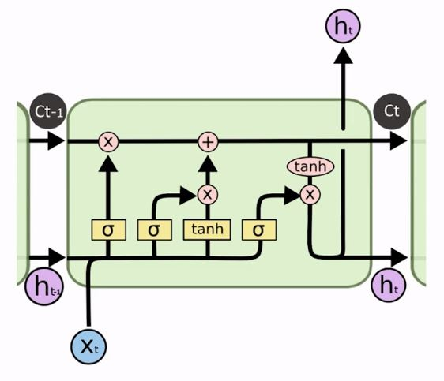
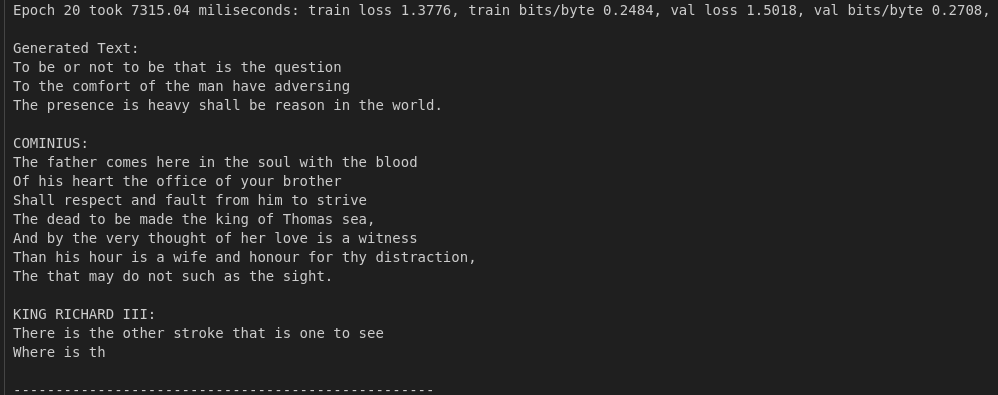
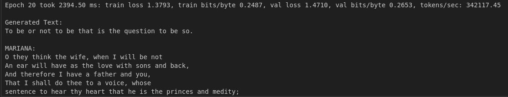
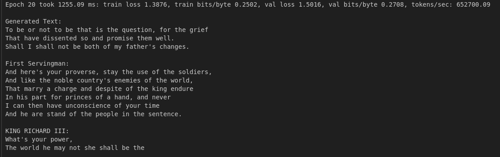

# LSTM

  

LSTMs have been around since the 2000s. However, it was after watching an Ilya Sutskever talk that I decided to write something and put it to the test. In this talk, he mentioned that this architecture was ancient history. When I heard this, I thought, "I have to create a small project that includes LSTMs." I know that we have many applications for them, like time series and text generation. Using LSTMs for text generation is outdated, but I prefer working with text rather than time series.

However, I did something that I took too long to do: Understand more about how GPUs work and how to optimize the code to make it faster. Here is the result of our first training:
 
 

  
   
  <em>Result 1</em>

 
By looking at this image, we can see that we got good metrics and are generating English words. However, the text lacks coherence. We've hit the bottleneck of LSTMs, the hidden state, this part of the network cannot look very far into the past. We have a context length of 128 tokens, but the result we get from this hidden state is equivalent to a context of only 3 tokens. I have no doubt that it would be possible to improve this, but LSTMs are no longer used for this type of task. Instead, let's focus on the training speed.

 

Looking at the image (notebook first_lstm), we can see that training took ≃ 7300 milliseconds. Not great, but not terrible. But what if we could improve this result? What if we could accelerate training without having to pay for a better GPU? In the notebook **first_lstm_improved**, we used mixed precision to accelerate the training and inference process. By doing this, we were able to reduce the time from ≃ 7300 to ≃ 2400 milliseconds, an improvement of ≃ 68%, which is pretty good considering that the T4 is a 7-year-old GPU.

 

  
   
  <em>Mixed precision result</em>

 

In the notebook **lstm_ampere_gpu**, I rented an A100 GPU. Just by running the same code we have in the vanilla notebook, we got a performance of around 1500 milliseconds. By just using torch.compile, we reduced it to ≃ 1255 milliseconds, a boost of roughly 16%. I tried to use FP16 here, but since we have a very small network, the computational overhead was stealing performance from the GPU.

 

  
   
  <em>Ampere GPU result</em>

